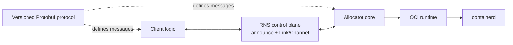
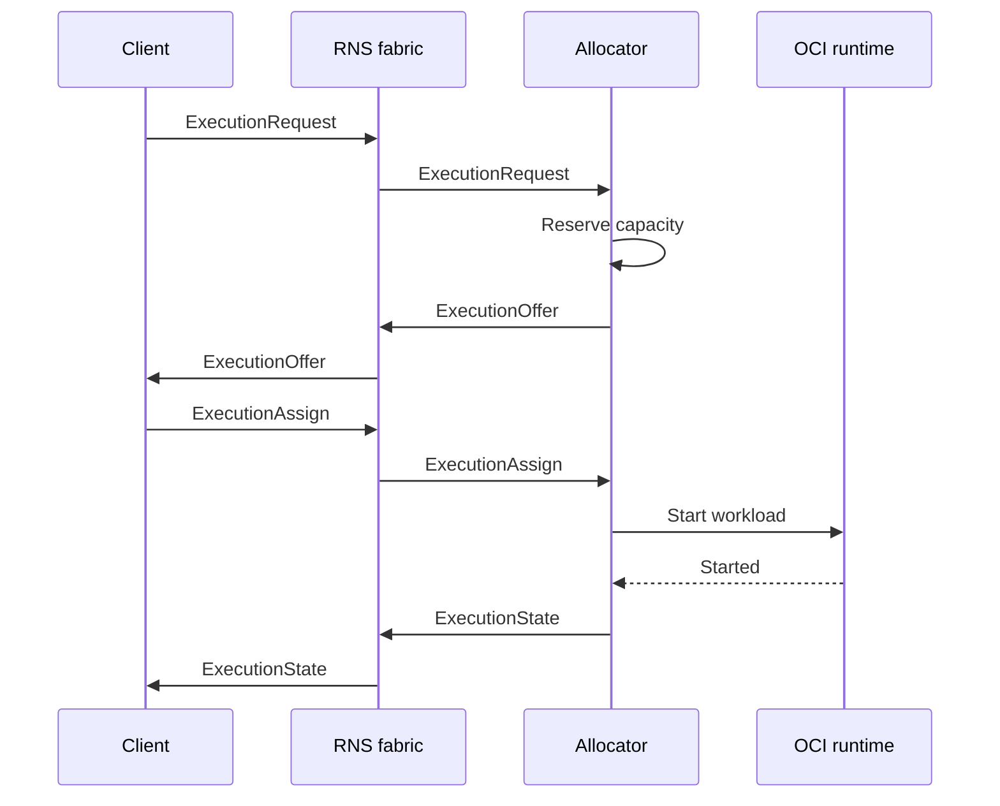

# r1s architecture

## Purpose

r1s runs OCI workloads across intermittently connected nodes without a central scheduler or a
cluster-wide source of truth. RNS supplies identity, addressing, discovery, routing, and encrypted
links. r1s supplies workload demand, local allocation, assignment, and execution lifecycle.

## Vocabulary

| Term | Meaning | Authority |
| --- | --- | --- |
| Client | `r1s` process that sends commands to allocators and chooses an offer | Its own requests and executions |
| Allocator | Node-local service that advertises and reserves capacity | Local capacity and runtime |
| Workload | Infrastructure-neutral OCI image, command, environment, and policy | Immutable request data |
| Offer | Bounded reservation proposed by one allocator | Issuing allocator |
| Execution | One selected, locally running workload instance | Client for commands; allocator for mechanics |
| Cluster key | Shared 256-bit membership secret distributed as a join token | Every holder is a cluster member |
| Cluster ID | Public domain-separated hash of the cluster key | Discovery label only; grants no access |

The core deliberately does not define agents, teams, prompts, CI jobs, or application-level event
hierarchies. Those are workloads or protocols layered on top.

## Components



The source boundaries are:

```text
api/proto/r1s/v1/       versioned wire schema
internal/protocol/      message validation and compatibility
internal/client/         durable requests, offer selection, and observed execution state
internal/cluster/        cluster key, public ID, join token, and local state
internal/allocator/     offers, capacity, assignment, authorization
internal/transport/     transport boundary and RNS adapter
internal/runtime/       runtime boundary and containerd adapter
```

The protocol, allocator, transport contract and in-memory adapter, runtime contract, RNS adapter,
and containerd adapter are present. Python-reference RNS discovery interoperability and reliable
Channel envelope delivery (including recovery from injected packet loss) are proven via a gated live
harness. Durable allocator and client state, restart reconciliation, and the complete partition
recovery acceptance harness are implemented. The live recovery harness remains gated for a Linux
host with containerd and has passed on the project test host.

## Commands

All executable entry points use the standard Go `cmd/<binary>/` layout. Command packages perform
configuration, dependency wiring, process lifecycle, and presentation only; protocol, allocator,
transport, runtime, and client behavior remains in reusable packages.

| Binary | Source | Purpose | Introduced by |
| --- | --- | --- | --- |
| `r1sd` | `cmd/r1sd/` | Allocator service and cluster bootstrap CLI | F2, F3, F12 |
| `r1s` | `cmd/r1s/` | Client, cluster bootstrap, and local client API CLI | F4, F12, F13 |

The `r1s` binary has two client-facing frontends sharing one durable client engine:

- **Direct mode** (default) builds an RNS endpoint, identity, and state store for the lifetime of a
  single command. `cluster` and `serve` run only in direct mode.
- **Service-backed mode** (`r1s --socket <path> …`) forwards `request`, `list`, `inspect`, `result`,
  `cancel`, and `logs` over a Unix socket to a persistent `r1s serve` process. `r1s serve`
  is a local, identity-scoped frontend (see the local client API section below), never a cluster API
  server. An unreachable socket is an error, never a fallback that creates a second identity or
  assignment. `r1s serve` is also the only continuous lease-renewal holder.

Build-time tools such as `protoc-gen-go` are not r1s commands and are not shipped as system
binaries.

## Local client API

The local client API is a versioned gRPC service (`r1s.v1.LocalClient`) served only on a Unix
socket by `r1s serve`. It fronts exactly one local client identity and shares all of the client's
authority, persistence, replay, and reconnect behavior; it owns no allocator state and performs no
global scheduling.

The `Watch` RPC streams durable execution-state transitions. Every accepted transition is assigned
a monotonic sequence that is persisted with the client snapshot, so a watcher resumes from an exact
durable position across service restarts without inventing or reordering revisions. The retained
journal is bounded; a watcher that falls behind is told to re-synchronize (`resync`) rather than
silently missing an event. Socket permissions default to `0600` and the socket is never exposed
over RNS, so the service cannot become a remotely reachable cluster-wide control endpoint.

The API surface is defined in `api/proto/r1s/v1/local.proto`; messages are additive and local-only
and never travel over the RNS control plane.

## Execution and deployment layers

The unit managed by r1s is one immutable execution. `request` creates one execution; `inspect`,
`result`, `logs`, and `cancel` address that execution explicitly. A request is
therefore not a deployment declaration.

The planned [F15 deployment reconciler](./roadmap/f15-deployment-reconciliation/README.md) adds
`r1s deploy` as a client-side layer over those execution operations. It owns durable deployment
names, desired specification hashes, and the mapping to execution IDs for one client identity. It
does not add deployment messages to the RNS protocol, allocator-owned desired state, a global
scheduler, or a cluster-wide source of truth.

`r1s deploy apply` reconciles a versioned manifest by requesting a changed workload, observing the
replacement through `inspect` or `Watch`, and explicitly cancelling the previous execution only
after the replacement reaches the required execution phase. An unchanged specification is a no-op,
and a failed replacement leaves the previous execution running. `RUNNING` reports only that the
runtime started an execution; application readiness, traffic switching, connection draining, load
balancing, replicas, and rollout strategies are not part of the first deployment task.

This boundary also preserves the lifetime rule below: losing a controller connection never stops
an assigned execution.

## Distributed authority

r1s has no globally consistent state:

- a client knows its requests, received offers, and selected executions;
- an allocator knows only its capacity, offers, and local executions;
- an execution knows its immutable workload and client;
- RNS routes between identities and destinations but does not become a durable job queue.

Conflicts are resolved by narrow authority rather than consensus. Only the authenticated client
that created a request may assign or cancel its execution. Only the allocator may claim its local
capacity or report local runtime state.

The RNS adapter must populate `Envelope.sender` from the authenticated link identity. A remote peer
must not be allowed to assert an arbitrary sender by serializing different bytes in the envelope.

Cluster membership is a separate transport-boundary authorization step. A participant loads a
random 256-bit `ClusterKey` from a local state file or an inline join token and derives the public
identifier as `SHA-256("r1s-cluster-id-v1" || ClusterKey)`. Allocators publish only that `ClusterID`
in announce app data, and clients ignore descriptors for other cluster IDs. The key and join token
are never announced or placed in protobuf envelopes.

For an explicit `--cluster` source, the value is first loaded as a file. Only a missing file falls
back to parsing the same value as an inline join token. Cluster management commands always treat
`--cluster` as their state file path.

After an RNS Link authenticates the peer identities, both sides exchange fresh nonces and prove
knowledge of the cluster key with
`HMAC-SHA256(ClusterKey, "r1s-auth-v1" || nonce || challenger_identity || responder_identity)`.
No control envelope is delivered until the peer's proof succeeds. This makes the verified RNS
sender authoritative for identity and the cluster proof authoritative for baseline membership.
Allocator-local admission and quotas from [F10](./roadmap/f10-local-admission/README.md) may further
restrict individual identities; they never replace transport-authenticated sender authority.

## Protocol

The planned source of truth is a versioned `r1s.v1` Protobuf schema. Every message will be wrapped
in an `Envelope` with a unique ID, authenticated sender, correlation ID, timestamp, and a `oneof`
payload. The package version will be part of the Protobuf namespace and import path.

The initial exchange is:

1. A client publishes `ExecutionRequest` with an OCI workload and `result_retention` policy.
2. An allocator with free capacity creates a time-bounded `ExecutionOffer`.
3. The client sends `ExecutionAssign` to exactly one allocator.
4. The allocator starts the workload under a durable client-held lease and publishes
   `ExecutionState` changes.
5. The client renews the lease with `ExecutionLeaseRenew` and may send `ExecutionCancel`; the
   allocator verifies the authenticated sender either way.



After either side restarts, the client may send `ExecutionInspect` to the selected allocator. The
allocator verifies the authenticated client and returns its latest durable `ExecutionState`. This
also supplies the first retained-result contract: terminal phase, detail, and exit code.

Offers reserve capacity but do not start the workload. This prevents every allocator from pulling
and starting the same image before the client makes a selection.

The client atomically stores its chosen assignment and stable `ExecutionOfferRelease` intents for
known losing offers. Each losing allocator verifies the authenticated owner and acknowledges a
released, expired, or assigned outcome. Only an outstanding reservation returns capacity; an
assigned execution is never changed by release. Late offers observed after selection get their own
durable release intent. Unknown release payloads on older allocators can be ignored safely because
the original offer TTL still bounds the reservation. New durable released-offer states require a
binary that understands them; an older allocator refuses that state rather than reopening capacity.

Protobuf evolution is additive: existing field numbers are never reused, removed fields are
reserved, and unknown fields must remain safe to ignore.

## Lifecycle under disconnection

Connection state never determines execution lifetime. After assignment, an execution continues
autonomously through a network partition. It ends only when one of these explicit conditions
occurs:

- the workload completes or fails;
- the authenticated client cancels it;
- its client-held lease expires without renewal and the allocator's lease sweep evicts it;
- a future local policy explicitly rejects or evicts it.

Every running execution carries a durably persisted lease held by the authenticated client. The
allocator grants an initial lease at assignment (10 minutes by default) and extends it on each
authenticated `ExecutionLeaseRenew` from the execution owner, bounded locally. Renewal is
idempotent and replay-safe and returns only the new expiry. A lease outlives any partition shorter
than its duration: connection state still never determines lifetime.

`r1s request --keep-alive` records a durable lease-holding intent and renews the lease for the
lifetime of the command: in direct mode the request process itself is the renewal loop and
re-requests the recorded workload whenever the lease is lost; in service-backed mode the flag is
forwarded to `r1s serve`, whose renewal loop replays every recorded intent from durable state on
each tick and performs the same re-request on lease loss. A renewal never attaches logs, results,
or other payload; it returns only the new expiry. Evicted executions commit terminal state with a
stable lease-expiry reason that is distinguishable from a client cancellation.

Terminal metadata is durably retained so a client can retrieve it after reconnecting. The
`result_retention` deadline, replay-safe tombstones, and bounded local log storage are enforced by
[F11](./roadmap/f11-state-retention/README.md) and [F9](./roadmap/f9-local-logs/README.md).

Container stdout/stderr belongs in local allocator storage. Logs are transferred only after an
explicit request from the authenticated execution owner. Completion, failure, cancellation,
reconnection, `inspect`, and `result` must never automatically send logs or attach log tails to
execution state or error details. A failed container changes lifecycle metadata only; the client
may separately request its logs when needed. A log request bounds the stream, offset, and byte
count; disconnection ends that transfer without affecting execution. The same explicit-request
rule stays if a future mechanism ever carries a requested log range outside the client command.

## Transport boundary

The RNS implementation will use announces only for small discovery descriptors. Protobuf control
messages will travel over authenticated Links, preferably with Channel semantics for ordered,
reliable delivery. RNS is not the bulk-transfer path: it carries control envelopes and discovery
descriptors only, never application bytes. Application data transfer outside the workload command
remains out of scope until separately designed.

An in-memory transport will implement the same interface for deterministic tests; it will not be a
simulation of routing, cryptography, or link behavior.

Allocator RNS endpoints announce capacity. Client endpoints are passive: they discover those
announces and establish authenticated Links without advertising fake allocator capacity.
Allocator descriptors also carry the public cluster ID. Foreign-cluster descriptors are ignored,
and direct links still require mutual cluster-key proof before their Channels can carry protobuf
control envelopes.

An endpoint identity may come from an existing or newly created 64-byte RNS identity file, or from
private identity bytes encoded as hex, Base32, or Base64 and imported through Reticulum-Go's
`rnsutil.ImportPrivateIdentity`. Existing files take precedence. Inline identity material is used
without being written to disk and is never included in diagnostic labels or derived filenames.

OCI image distribution is outside the r1s protocol. A workload continues to name a
digest-pinned image, and containerd may fetch it from any standard OCI registry reachable through
the Internet, a LAN, a mirror, or local cache. r1s does not implement an image transport or
registry protocol.

Container stdout and stderr remain allocator-local. Only an explicit request from the authenticated
execution owner may transfer a bounded range of logs; completion, failure, inspection, result
retrieval, and reconnection never do so implicitly.

## Runtime boundary

The runtime interface accepts a stable execution ID and requires idempotent start and stop. The
containerd adapter isolates metadata in an r1s namespace, requires digest-pinned images, derives
container IDs from execution IDs, and verifies stored identity/specification labels before reuse.
VM or microVM backends may be added without changing the control protocol, but they are not part of
the initial milestone.

## Persistence and recovery

The allocator stores one versioned state snapshot in a transactional bbolt database after every
accepted transition. The snapshot is bound to the allocator's authenticated identity and contains
offers, assignments, execution state, replay records, the durable client-held lease expiry for
every running execution, and the original start time.

At startup, `r1sd` restores capacity accounting and reconciles non-terminal records with containerd
before accepting transport messages. Matching running or stopped tasks regain completion
monitoring without being restarted, and an execution whose persisted lease is still valid keeps
running; one whose lease already expired is evicted instead of revived. A missing task or
mismatched execution/specification label becomes a terminal failure; a persisted cancellation is
completed idempotently. Terminal state is committed before containerd metadata is removed so a
store failure leaves a stopped task available for the next recovery attempt.

Result storage beyond terminal metadata remains open in [BACKLOG.md](./roadmap/BACKLOG.md).

Client requests, offers, the chosen assignment, allocator route, cancellation intent, and latest
observed state are stored in a separate identity-bound bbolt snapshot. Assignment message IDs and
timestamps are durable, so retry after a crash replays the same assignment rather than choosing a
second allocator. Inspect uses a fresh message ID so allocator replay caching cannot return an old
state.

When an identity comes from a file, the default state database remains beside that file. When it is
provided inline, the default state and allocator log paths live under `~/.config/r1s` and use the
public identity hash rather than private identity material. Explicit `--state` and `--logs` paths
override those defaults.

The gated end-to-end recovery harness runs `r1sd` as a separate process over a loopback RNS UDP
pair. It disconnects the client, restarts the allocator while the labelled containerd task remains
running, waits for offline completion, restores the client, replays its durable assignment, and
retrieves terminal metadata with a fresh inspect. A second real workload proves repeated request
and cancellation envelopes remain idempotent.
