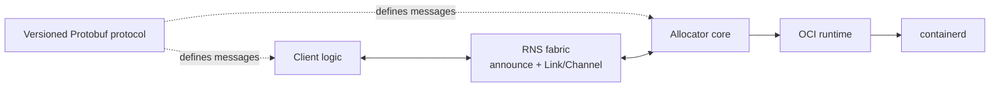

# r1s architecture

## Purpose

r1s runs OCI workloads across intermittently connected nodes without a central scheduler or a
cluster-wide source of truth. RNS supplies identity, addressing, discovery, routing, and encrypted
links. r1s supplies workload demand, local allocation, assignment, and execution lifecycle.

## Vocabulary

| Term | Meaning | Authority |
| --- | --- | --- |
| Client | `r1s` process that sends commands to allocators and chooses an offer | Its own requests and executions |
| Allocator | Node-local service that advertises and reserves capacity | Local capacity and runtime |
| Workload | Infrastructure-neutral OCI image, command, environment, and policy | Immutable request data |
| Offer | Bounded reservation proposed by one allocator | Issuing allocator |
| Execution | One selected, locally running workload instance | Client for commands; allocator for mechanics |

The core deliberately does not define agents, teams, prompts, CI jobs, or application-level event
hierarchies. Those are workloads or protocols layered on top.

## Components



The source boundaries are:

```text
api/proto/r1s/v1/       versioned wire schema
internal/protocol/      message validation and compatibility
internal/client/         durable requests, offer selection, and observed execution state
internal/allocator/     offers, capacity, assignment, authorization
internal/transport/     transport boundary and RNS adapter
internal/runtime/       runtime boundary and containerd adapter
```

The protocol, allocator, transport contract and in-memory adapter, runtime contract, RNS adapter,
and containerd adapter are present. Python-reference RNS discovery interoperability and reliable
Channel envelope delivery (including recovery from injected packet loss) are proven via a gated live
harness. Durable allocator state and restart reconciliation are implemented; live containerd
lifecycle and recovery acceptance remain gated for a Linux host with containerd.

## Commands

All executable entry points use the standard Go `cmd/<binary>/` layout. Command packages perform
configuration, dependency wiring, process lifecycle, and presentation only; protocol, allocator,
transport, runtime, and client behavior remains in reusable packages.

| Binary | Source | Purpose | Introduced by |
| --- | --- | --- | --- |
| `r1sd` | `cmd/r1sd/` | Long-running allocator service connected to RNS and containerd | F2, extended by F3 |
| `r1s` | `cmd/r1s/` | Client CLI for request, list, inspect, cancel, and result operations | F4 |

Build-time tools such as `protoc-gen-go` are not r1s commands and are not shipped as system
binaries.

## Distributed authority

r1s has no globally consistent state:

- a client knows its requests, received offers, and selected executions;
- an allocator knows only its capacity, offers, and local executions;
- an execution knows its immutable workload and client;
- RNS routes between identities and destinations but does not become a durable job queue.

Conflicts are resolved by narrow authority rather than consensus. Only the authenticated client
that created a request may assign or cancel its execution. Only the allocator may claim its local
capacity or report local runtime state.

The RNS adapter must populate `Envelope.sender` from the authenticated link identity. A remote peer
must not be allowed to assert an arbitrary sender by serializing different bytes in the envelope.

## Protocol

The planned source of truth is a versioned `r1s.v1` Protobuf schema. Every message will be wrapped
in an `Envelope` with a unique ID, authenticated sender, correlation ID, timestamp, and a `oneof`
payload. The package version will be part of the Protobuf namespace and import path.

The initial exchange is:

1. A client publishes `ExecutionRequest` with an OCI workload and finite policy.
2. An allocator with free capacity creates a time-bounded `ExecutionOffer`.
3. The client sends `ExecutionAssign` to exactly one allocator.
4. The allocator starts the workload and publishes `ExecutionState` changes.
5. The client may send `ExecutionCancel`; the allocator verifies the authenticated sender.

After either side restarts, the client may send `ExecutionInspect` to the selected allocator. The
allocator verifies the authenticated client and returns its latest durable `ExecutionState`. This
also supplies the first retained-result contract: terminal phase, detail, and exit code. Stream and
artifact results remain deferred in [BACKLOG.md](./roadmap/BACKLOG.md).

Offers reserve capacity but do not start the workload. This prevents every allocator from pulling
and starting the same image before the client makes a selection.

Protobuf evolution is additive: existing field numbers are never reused, removed fields are
reserved, and unknown fields must remain safe to ignore.

## Lifecycle under disconnection

Connection state never determines execution lifetime. After assignment, an execution continues
autonomously through a network partition. It ends only when one of these explicit conditions occurs:

- the workload completes or fails;
- the authenticated client cancels it;
- its deadline or maximum runtime is reached;
- a future local policy explicitly rejects or evicts it.

Completed results may be retained for `result_retention` so a client can retrieve them after
reconnecting. Result transfer and persistence are not implemented in the first slice.

## Transport boundary

The RNS implementation will use announces only for small discovery descriptors. Protobuf control
messages will travel over authenticated Links, preferably with Channel semantics for ordered,
reliable delivery. Large artifacts belong in RNS Resources or an external artifact plane, not in
announces or small control envelopes.

An in-memory transport will implement the same interface for deterministic tests; it will not be a
simulation of routing, cryptography, or link behavior.

Allocator RNS endpoints announce capacity. Client endpoints are passive: they discover those
announces and establish authenticated Links without advertising fake allocator capacity.

## Runtime boundary

The runtime interface accepts a stable execution ID and requires idempotent start and stop. The
containerd adapter isolates metadata in an r1s namespace, requires digest-pinned images, derives
container IDs from execution IDs, and verifies stored identity/specification labels before reuse.
VM or microVM backends may be added without changing the control protocol, but they are not part of
the initial milestone.

## Persistence and recovery

The allocator stores one versioned state snapshot in a transactional bbolt database after every
accepted transition. The snapshot is bound to the allocator's authenticated identity and contains
offers, assignments, execution state, replay records, and the original start time used for local
deadline enforcement.

At startup, `r1sd` restores capacity accounting and reconciles non-terminal records with containerd
before accepting transport messages. Matching running or stopped tasks regain completion and
deadline monitoring without being restarted. A missing task or mismatched execution/specification
label becomes a terminal failure; a persisted cancellation is completed idempotently. Terminal
state is committed before containerd metadata is removed so a store failure leaves a stopped task
available for the next recovery attempt.

Result storage beyond terminal metadata remains open in [BACKLOG.md](./roadmap/BACKLOG.md).

Client requests, offers, the chosen assignment, allocator route, cancellation intent, and latest
observed state are stored in a separate identity-bound bbolt snapshot. Assignment message IDs and
timestamps are durable, so retry after a crash replays the same assignment rather than choosing a
second allocator. Inspect uses a fresh message ID so allocator replay caching cannot return an old
state.
