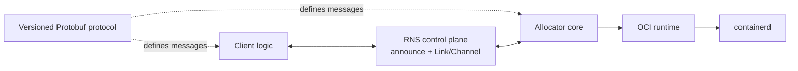
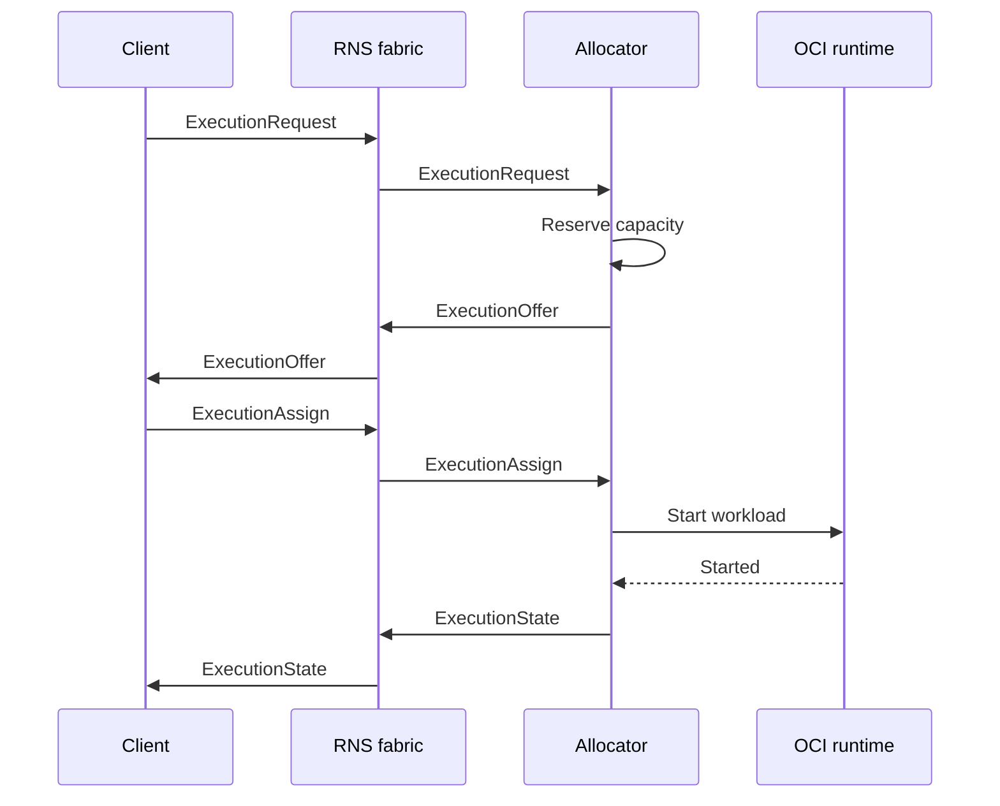

# r1s architecture

## Purpose

r1s runs OCI workloads across intermittently connected nodes without a central scheduler or a
cluster-wide source of truth. RNS supplies identity, addressing, discovery, routing, and encrypted
links. r1s supplies workload demand, local allocation, assignment, and execution lifecycle.

## Vocabulary

| Term | Meaning | Authority |
| --- | --- | --- |
| Client | `r1s` process that sends commands to allocators and chooses an offer | Its own requests and executions |
| Allocator | Node-local service that advertises and reserves capacity | Local capacity and runtime |
| Workload | Infrastructure-neutral OCI image, command, environment, and policy | Immutable request data |
| Offer | Bounded reservation proposed by one allocator | Issuing allocator |
| Execution | One selected, locally running workload instance | Client for commands; allocator for mechanics |
| Cluster key | Shared 256-bit membership secret distributed as a join token | Every holder is a cluster member |
| Cluster ID | Public domain-separated hash of the cluster key | Discovery label only; grants no access |

The core deliberately does not define agents, teams, prompts, CI jobs, or application-level event
hierarchies. Those are workloads or protocols layered on top.

## Components



The source boundaries are:

```text
api/proto/r1s/v1/       versioned wire schema
internal/protocol/      message validation and compatibility
internal/client/         in-memory request state, offer selection, and observed execution state
internal/cluster/        cluster key, public ID, join token, and local state
internal/allocator/     offers, capacity, assignment, authorization
internal/transport/     transport boundary and RNS adapter
internal/runtime/       runtime boundary and containerd adapter
```

The protocol, allocator, transport contract and in-memory adapter, runtime contract, RNS adapter,
and containerd adapter are present. Python-reference RNS discovery interoperability and reliable
Channel envelope delivery (including recovery from injected packet loss) are proven via a gated live
harness. Durable allocator state, restart reconciliation, and the complete partition
recovery acceptance harness are implemented. The live recovery harness remains gated for a Linux
host with containerd and has passed on the project test host.

## Commands

All executable entry points use the standard Go `cmd/<binary>/` layout. Command packages perform
configuration, dependency wiring, process lifecycle, and presentation only; protocol, allocator,
transport, runtime, and client behavior remains in reusable packages.

| Binary | Source | Purpose | Introduced by |
| --- | --- | --- | --- |
| `r1sd` | `cmd/r1sd/` | Allocator service and cluster bootstrap CLI | F2, F3, F12 |
| `r1s` | `cmd/r1s/` | Client `run` and cluster bootstrap CLI | F4, F12, F22 |

Since F22-07 removed the legacy client control plane, the `r1s` binary has a single run-oriented
frontend plus the cluster bootstrap commands. `run` creates a fresh RNS identity and an in-memory
client engine (no durable state, no local socket). The process owns discovery, deterministic offer
selection, loser release, assignment, authenticated inspection, lease renewal,
conclusive-loss rescheduling, and signal cancellation. Terminal-record retention on the allocator is
an operator policy, not workload input.

Build-time tools such as `protoc-gen-go` are not r1s commands and are not shipped as system
binaries.

## Local client API (removed)

The pre-F22 local client API — the `r1s.v1.LocalClient` gRPC service, `r1s serve`, the Unix-socket
`--socket` routing, and the `Watch` journal — was removed by F22-07. There is no durable client
state, watch sequence, or local socket; the client is an ephemeral in-memory process that owns a
run for its lifetime and keeps nothing across restart. See
[F22-07](./roadmap/f22-rns-shared-instance/f22-07-client-cleanup.md).

## Execution and deployment layers

The unit managed by r1s is one immutable execution of a logical run, created by `r1s run`. The
run engine owns the lease, observes terminal state, and re-requests the recorded workload as the
next attempt on authenticated evidence of conclusive loss. A single execution is therefore not a
deployment declaration.

The closest thing to desired state is the run-lifetime lease held by the in-memory run engine
([F17](./roadmap/f17-execution-lease/README.md)): a lost lease converts into a re-request of the
recorded workload, so one run heals across restarts of the previous execution without becoming a
deployment declaration. A manifest-driven
`r1s deploy` layer — durable deployment names, desired specification hashes, and the mapping to
execution IDs for one client identity — was planned as
[F15](./roadmap/f15-deployment-reconciliation/README.md) and is deferred (see
[BACKLOG.md](./roadmap/BACKLOG.md)). It would have stayed a client-side layer over the same
execution operations, without deployment messages in the RNS protocol, allocator-owned desired
state, a global scheduler, or a cluster-wide source of truth. F15's desired state and its
client-owned record would have been ephemeral in-process state under the F22 model, not a durable
client database.

This boundary also preserves the lifetime rule below: losing a controller connection never stops
an assigned execution.

## Distributed authority

r1s has no globally consistent state:

- a client knows its requests, received offers, and selected executions;
- an allocator knows only its capacity, offers, and local executions;
- an execution knows its immutable workload and client;
- RNS routes between identities and destinations but does not become a durable job queue.

Conflicts are resolved by narrow authority rather than consensus. Only the authenticated client
that created a request may assign or cancel its execution. Only the allocator may claim its local
capacity or report local runtime state.

Placement from [F16](./roadmap/f16-node-placement/README.md) extends the client's side of this
boundary without creating a scheduler. Allocators advertise bounded capabilities (OS, architecture,
runtime, devices, resource profiles, operator labels) in offers and a compact RNS announce summary;
clients express exact-match constraints and only compatible allocators receive the request. The
advertisement is never the authority: incompatible requests are rejected by the allocator before any
capacity is reserved, and assignment re-validates placement against current local state so a stale or
false advertisement yields an explicit `INCOMPATIBLE` rejection, never an invalid start.

The RNS adapter must populate `Envelope.sender` from the authenticated link identity. A remote peer
must not be allowed to assert an arbitrary sender by serializing different bytes in the envelope.

Cluster membership is a separate transport-boundary authorization step. A participant loads a
random 256-bit `ClusterKey` from `~/.config/r1s/clusters/<cluster-id>` and derives the public
identifier as `SHA-256("r1s-cluster-id-v1" || ClusterKey)`. `cluster init` and `cluster join` write
credentials atomically with owner-only permissions; `cluster list` exposes only their public IDs.
Runtime selection requires a full ID or unique hexadecimal prefix and never accepts a join token.
The legacy single credential file is not an implicit default or migration source.

Allocators publish only the selected `ClusterID` in announce app data, and clients ignore
descriptors for other cluster IDs. The key and join token are never announced or placed in
protobuf envelopes. One allocator process selects exactly one cluster; cluster ID and key remain
outside workload data and `ExecutionRequest`.

After an RNS Link authenticates the peer identities, both sides exchange fresh nonces and prove
knowledge of the cluster key with
`HMAC-SHA256(ClusterKey, "r1s-auth-v1" || nonce || challenger_identity || responder_identity)`.
No control envelope is delivered until the peer's proof succeeds. This makes the verified RNS
sender authoritative for identity and the cluster proof authoritative for baseline membership.
Allocator-local admission and quotas from [F10](./roadmap/f10-local-admission/README.md) may further
restrict individual identities; they never replace transport-authenticated sender authority.

## Protocol

The planned source of truth is a versioned `r1s.v1` Protobuf schema. Every message will be wrapped
in an `Envelope` with a unique ID, authenticated sender, correlation ID, timestamp, and a `oneof`
payload. The package version will be part of the Protobuf namespace and import path.

The initial exchange is:

1. A client publishes `ExecutionRequest` with an OCI workload, resource class, and constraints.
2. An allocator with free capacity creates a time-bounded `ExecutionOffer`.
3. The client sends `ExecutionAssign` to exactly one allocator.
4. The allocator starts the workload under a durable client-held lease and publishes
   `ExecutionState` changes.
5. The client renews the lease with `ExecutionLeaseRenew` and may send `ExecutionCancel`; the
   allocator verifies the authenticated sender either way.



After either side restarts, the client may send `ExecutionInspect` to the selected allocator. The
allocator verifies the authenticated client and returns its latest durable `ExecutionState`. This
also supplies the first retained-result contract: terminal phase, detail, and exit code.

Offers reserve capacity but do not start the workload. This prevents every allocator from pulling
and starting the same image before the client makes a selection.

The client atomically stores its chosen assignment and stable `ExecutionOfferRelease` intents for
known losing offers. Each losing allocator verifies the authenticated owner and acknowledges a
released, expired, or assigned outcome. Only an outstanding reservation returns capacity; an
assigned execution is never changed by release. Late offers observed after selection get their own
durable release intent. Unknown release payloads on older allocators can be ignored safely because
the original offer TTL still bounds the reservation. New durable released-offer states require a
binary that understands them; an older allocator refuses that state rather than reopening capacity.

Protobuf evolution is additive: existing field numbers are never reused, removed fields are
reserved, and unknown fields must remain safe to ignore.

## Lifecycle under disconnection

Connection state never determines execution lifetime. After assignment, an execution continues
autonomously through a network partition. It ends only when one of these explicit conditions
occurs:

- the workload completes or fails;
- the authenticated client cancels it;
- its client-held lease expires without renewal and the allocator's lease sweep evicts it;
- a future local policy explicitly rejects or evicts it.

Every running execution carries a durably persisted lease held by the authenticated client. The
allocator grants an initial lease at assignment (10 minutes by default) and extends it on each
authenticated `ExecutionLeaseRenew` from the execution owner, bounded locally. Renewal is
idempotent and replay-safe and returns only the new expiry. A lease outlives any partition shorter
than its duration: connection state still never determines lifetime.

One logical run has a random 128-bit `run_id` encoded as 32 lowercase hexadecimal characters.
Each fresh announcement increments its positive `attempt` and receives a new `request_id` and
`execution_id`; an execution never migrates between allocators. Allocators persist this correlation
with the execution and expose it to the workload as container labels `io.r1s.run-id` and
`io.r1s.attempt` and environment variables `R1S_RUN_ID` and `R1S_ATTEMPT`. These values support
application-level fencing and idempotency but grant no authority: the transport-authenticated
sender remains the owner.

Rescheduling is at-least-once. An authenticated `EXPIRED`/`NOT_FOUND` or observed lease-expiry
terminal state may advance the attempt; a timeout or one missing renewal acknowledgement does not.
Because a renewal can succeed while its acknowledgement is lost, a conservative future
lease-loss threshold may allow two attempts to overlap. r1s introduces no coordinator and makes no
exactly-once claim.

`r1s run` holds the lease for the lifetime of the command: the run engine is the renewal loop and
re-requests the recorded workload whenever the lease is lost, advancing to the next attempt. The
intent lives only in the in-memory client; process restart cannot reclaim the old execution, whose
allocator-enforced lease expires independently. A renewal never attaches logs, results,
or other payload; it returns only the new expiry. Evicted executions commit terminal state with a
stable lease-expiry reason that is distinguishable from a client cancellation.

Terminal metadata is durably retained by the allocator so a client can retrieve it after
reconnecting. The allocator-configured retention deadline, replay-safe tombstones, and bounded
local log storage are enforced by
[F11](./roadmap/f11-state-retention/README.md) and [F9](./roadmap/f9-local-logs/README.md).

Container stdout/stderr belongs in local allocator storage. Logs are transferred only after an
explicit request from the authenticated execution owner. Completion, failure, cancellation,
reconnection, `inspect`, and `result` must never automatically send logs or attach log tails to
execution state or error details. A failed container changes lifecycle metadata only; the client
may separately request its logs when needed. A log request bounds the stream, offset, and byte
count; disconnection ends that transfer without affecting execution. The same explicit-request
rule stays if a future mechanism ever carries a requested log range outside the client command.

## Transport boundary

The RNS implementation uses announces only for small discovery descriptors. Protobuf control
messages travel over authenticated Links with Channel semantics for ordered, reliable delivery.
RNS is not the bulk-transfer path: it carries control envelopes and discovery descriptors, never
application bytes.

Production `r1s` and `r1sd` endpoints attach only as clients to an already-running Reticulum shared
instance at the Reticulum-Go platform default (the Linux abstract Unix socket, or the supported TCP
default on other platforms). Failure to connect is fatal and never elects r1s as the shared-instance
server. Explicit standalone transports remain confined to deterministic and live test harnesses.

Execution-tunnel application bytes use the dedicated embedded Yggdrasil adapter from F19/F20. RNS
authorizes and transports the bounded owner-authenticated open exchange; the resulting
peer-key-pinned Ygg mesh pair carries the multiplexed TCP streams. F21 evaluated replacing this data
plane with a separate private RNS `Link`/`Channel`/`Buffer` stack over system Ygg, but the recorded
F21-05 benchmark was a no-go: the optimized compatible path remained 26.7–39.9× slower in
representative rows because of the small RNS stream payload, bounded Channel window, per-packet
signed proofs, IFAC processing, and small Backbone writes. The experimental path is rolled back in
F21-06; application bytes do not move onto the RNS control plane.

Application data transfer outside the execution tunnel remains out of scope until separately
designed.

An in-memory transport will implement the same interface for deterministic tests; it will not be a
simulation of routing, cryptography, or link behavior.

Allocator RNS endpoints announce capacity. Client endpoints are passive: they discover those
announces and establish authenticated Links without advertising fake allocator capacity.
Allocator descriptors also carry the public cluster ID. Foreign-cluster descriptors are ignored,
and direct links still require mutual cluster-key proof before their Channels can carry protobuf
control envelopes.

An endpoint identity may come from an existing or newly created 64-byte RNS identity file, or from
private identity bytes encoded as hex, Base32, or Base64 and imported through Reticulum-Go's
`rnsutil.ImportPrivateIdentity`. Existing files take precedence. Inline identity material is used
without being written to disk and is never included in diagnostic labels or derived filenames.

OCI image distribution is outside the r1s protocol. A workload continues to name a
digest-pinned image, and containerd may fetch it from any standard OCI registry reachable through
the Internet, a LAN, a mirror, or local cache. r1s does not implement an image transport or
registry protocol.

Container stdout and stderr remain allocator-local. Only an explicit request from the authenticated
execution owner may transfer a bounded range of logs; completion, failure, inspection, result
retrieval, and reconnection never do so implicitly.

## Runtime boundary

The runtime interface accepts a stable execution ID plus its run ID and attempt, and requires
idempotent start and stop. The
containerd adapter isolates metadata in an r1s namespace, requires digest-pinned images, derives
container IDs from execution IDs, and verifies stored identity/specification labels before reuse.
VM or microVM backends may be added without changing the control protocol, but they are not part of
the initial milestone.

Execution-port access uses the optional runtime `PortDialer` interface. The allocator validates
an active registry-issued session and its allowed port before each dial. The containerd adapter
verifies execution labels and the live task, pins its Linux network namespace, and connects to
container loopback on a dedicated OS thread. Host-network namespaces and non-local containerd
endpoints are rejected. The host namespace is restored before the thread is reused; a restoration
failure discards the thread. Fresh container loopback is brought up inside that namespace.

A terminal execution closes the session's revocation signal. The edge closes its mesh pair,
all streams, pending dials, and target sockets. Ending a mesh connection releases only its own
registry session, allowing a later owner open without affecting execution lifetime. Pair-level close
frames preserve the reason at the remote handshake and active streams. Frame sizing includes
the seven-byte header both in the packet MTU budget and the receive buffer.

## Persistence and recovery

The allocator stores one versioned state snapshot in a transactional bbolt database after every
accepted transition. The snapshot is bound to the allocator's authenticated identity and contains
offers, assignments, execution state, replay records, the durable client-held lease expiry for
every running execution, and the original start time.

At startup, `r1sd` restores capacity accounting and reconciles non-terminal records with containerd
before accepting transport messages. Matching running or stopped tasks regain completion
monitoring without being restarted, and an execution whose persisted lease is still valid keeps
running; one whose lease already expired is evicted instead of revived. A missing task or
mismatched execution/specification label becomes a terminal failure; a persisted cancellation is
completed idempotently. Terminal state is committed before containerd metadata is removed so a
store failure leaves a stopped task available for the next recovery attempt.

Result storage beyond terminal metadata remains open in [BACKLOG.md](./roadmap/BACKLOG.md).

The client keeps no durable state: it does not persist requests, offers, assignments, or observed
state anywhere on disk. The run engine holds all of it in memory for the run's lifetime; a client
process restart starts fresh authority and cannot reclaim an old execution, whose allocator-enforced
lease expires independently. Inspection is the explicit authenticated read that recovers terminal
metadata from the allocator after a reconnect.

The gated end-to-end recovery harness runs `r1sd` as a separate process over a loopback RNS UDP
pair. It disconnects the client, restarts the allocator while the labelled containerd task remains
running, waits for offline completion, reconnects a fresh ephemeral client, replays its assignment
against the allocator's durable state, and retrieves terminal metadata with a fresh inspect. A
second real workload proves repeated request and cancellation envelopes remain idempotent.
