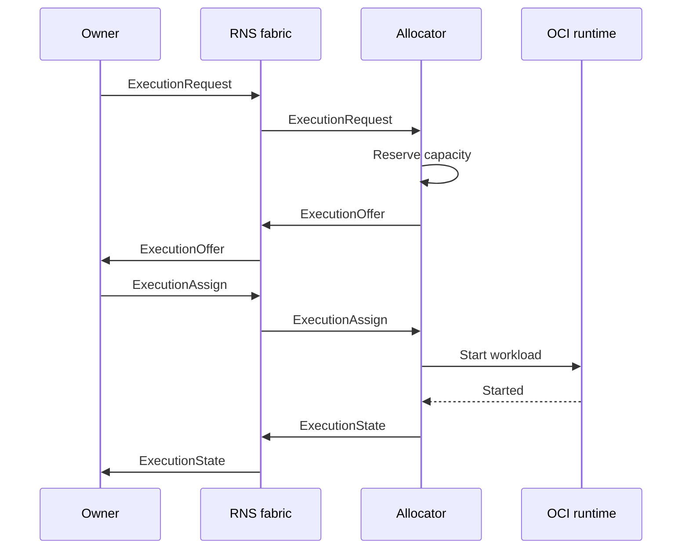

# r1s

r1s is a decentralized OCI workload execution fabric over the Reticulum Network Stack (RNS).
Owners publish workload demand, independent allocators offer local capacity, and an owner selects
an execution directly. There is no cluster-wide API server, scheduler, registry, or global state.

The name follows the same contraction pattern as Kubernetes → k8s: Reticulum Network Stack → r1s.

## Status

r1s has completed its transport-independent protocol foundation: the versioned wire schema,
message validation, allocator state machine, runtime contract, replay protection, and deterministic
in-memory transport are implemented and tested. The production RNS and containerd adapters remain
planned work.

## Design principles

- **RNS-native:** discovery uses announces and control messages use authenticated RNS links.
- **No global control plane:** each owner controls its tasks; each allocator controls local capacity.
- **Asynchronous protocol:** Protobuf messages are carried over RNS without imposing HTTP/2 or RPC
  semantics on the network.
- **OCI workloads:** the core describes generic images, commands, environment, and execution policy.
- **Partition tolerant:** an owner disconnect is not a lifecycle event. Assigned work continues until
  completion, explicit cancellation, deadline, or maximum runtime.
- **Replaceable adapters:** network and runtime implementations sit behind small Go interfaces.

## Control flow



An offer reserves a bounded local slot. Workload start happens only after the owner selects that
offer, avoiding speculative image pulls on every allocator that sees a request.

## Development

The planned system binaries follow the standard Go command layout: `cmd/r1sd/` contains the
allocator daemon and `cmd/r1s/` contains the owner CLI. They will be added by the milestones that
introduce their runnable dependencies.

Regenerate Go bindings after changing the Protobuf schema:

```sh
make generate
```

Generation requires `protoc` 36.0; the matching `protoc-gen-go` version is pinned in
[go.mod](./go.mod) and built automatically.

Run generated-code verification, race-enabled Go tests, and documentation link checks:

```sh
make check
```

Go 1.26.5 is recorded in [go.mod](./go.mod) as the language baseline.

## Documentation

- [AGENTS.md](./AGENTS.md) — repository rules for automated contributors.
- [ARCHITECTURE.md](./ARCHITECTURE.md) — component boundaries, authority, and lifecycle.
- [ROADMAP.md](./ROADMAP.md) — entry point to the plan, features, and implementation tasks.
- [CONTRIBUTING.md](./CONTRIBUTING.md) — development and verification workflow.
- [`roadmap/`](./roadmap/README.md) — vision, features, tasks, and open decisions.

## License

r1s is available under the [MIT License](./LICENSE).
