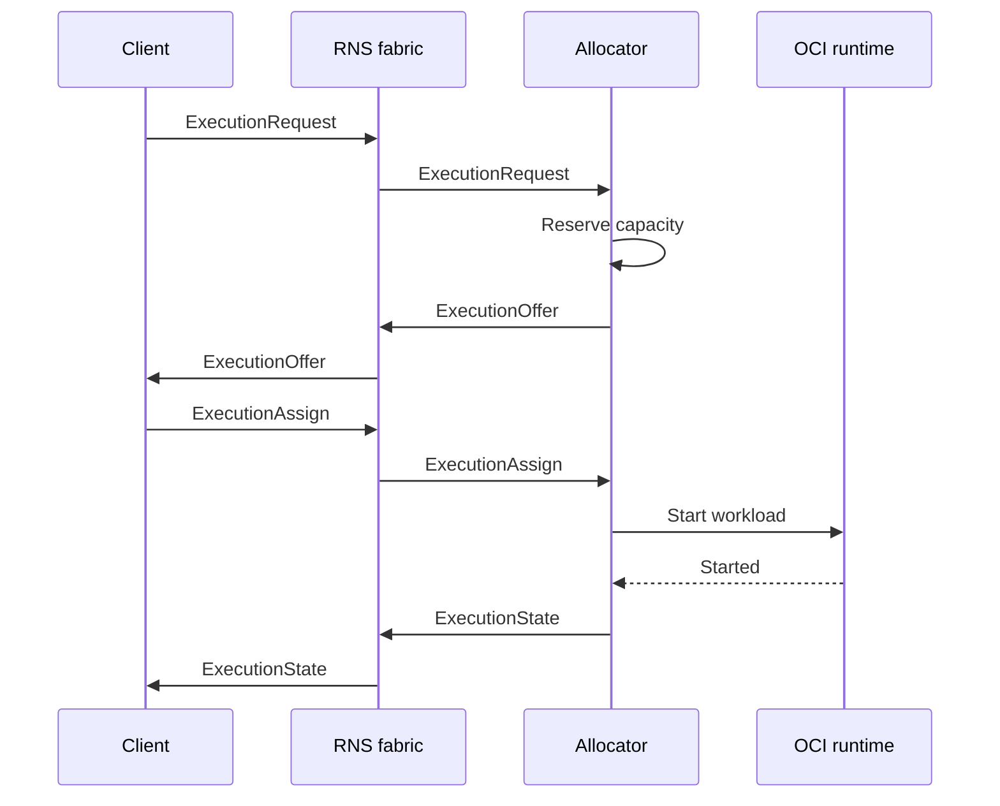

# r1s

r1s is a decentralized OCI workload execution fabric over the Reticulum Network Stack (RNS). The
`r1s` process is a client of independent `r1sd` allocators: it publishes workload demand, collects
their offers, and selects one execution directly. There is no cluster-wide API server, scheduler,
registry, or global state.

The name follows the same contraction pattern as Kubernetes → k8s: Reticulum Network Stack → r1s.

## Status

r1s has completed its transport-independent protocol foundation, RNS transport, OCI runtime,
initial client workflow, and partition-recovery acceptance. The embedded
Reticulum-Go adapter, authenticated sender replacement, allocator announces, and `r1sd` entry point
are covered by a two-node loopback test. Python-reference discovery and reliable Channel envelope
delivery (including recovery from injected packet loss) are proven by a gated live harness. OCI
runtime lifecycle and restart reconciliation are covered by deterministic tests and a live
containerd harness. The `r1s` client durably creates requests, selects offers, returns immediately
after assignment, inspects state after restart, cancels executions, and reads retained terminal
metadata. Linux lifecycle, recovery, cancellation, two-allocator client acceptance, and complete
partition recovery were run on `mytecor-homelab` on 2026-09-14.

## Design principles

- **RNS-native:** discovery uses announces and control messages use authenticated RNS links.
- **No global control plane:** each client controls its tasks; each allocator controls local capacity.
- **Asynchronous protocol:** Protobuf messages are carried over RNS without imposing HTTP/2 or RPC
  semantics on the network.
- **OCI workloads:** the core describes generic images, commands, environment, and execution policy.
- **Partition tolerant:** a client disconnect is not a lifecycle event. Assigned work continues until
  completion, explicit cancellation, deadline, or maximum runtime.
- **Replaceable adapters:** network and runtime implementations sit behind small Go interfaces.

## Control flow



An offer reserves a bounded local slot. Workload start happens only after the client selects that
offer, avoiding speculative image pulls on every allocator that sees a request.

Selection durably records release commands for all known losing offers. The client sends them in
the background and also releases late offers received while it remains connected. Every network
command retries unacknowledged, unexpired releases using their original message IDs. CLI shutdown
allows up to two seconds for release acknowledgements and reports remaining releases on stderr;
allocator expiry remains the fallback. Releasing an assigned offer never cancels its execution.

## Install

Download the archive for your platform from the [releases page](https://github.com/mytecor/r1s/releases)
and put the binaries on `PATH`. Builds cover Linux, macOS, and Windows on `amd64` and `arm64`, and
every release archive carries both `r1sd` and `r1s` and a copy of this `README.md`. The binaries are
unsigned, so a macOS download through a browser needs `xattr -d com.apple.quarantine` before the first
run.

The `r1sd` daemon and the `r1s` client can be installed independently or together into a directory on
`PATH`:

```sh
mkdir -p "$HOME/.local/bin"
cp r1sd r1s "$HOME/.local/bin/"
# macOS only: remove the quarantine attribute from browser downloads first
xattr -d com.apple.quarantine "$HOME/.local/bin/r1sd" "$HOME/.local/bin/r1s"
```

`r1sd --version` and `r1s --version` report the release version; source builds report `dev`. Every
release publishes a `SHA256SUMS` file covering all of its archives; verify a download against it
before use:

```sh
sha256sum -c SHA256SUMS
```

The binaries expect a reachable containerd daemon and a Reticulum-Go configuration; see the
[Development](#development) section for how to run them.

### Build from source

Needs Go 1.26.5+. The module pins its Reticulum-Go dependency with `replace` directives, which
`go install <module>@latest` rejects, so clone first:

```sh
git clone https://github.com/mytecor/r1s
cd r1s
GOBIN="$HOME/.local/bin" go install ./cmd/r1s ./cmd/r1sd
```

## Development

System binaries follow the standard Go command layout. [`cmd/r1sd/`](./cmd/r1sd/) contains the
allocator daemon and [`cmd/r1s/`](./cmd/r1s/) contains the client CLI.

The initial allocator daemon can be run with an explicit Reticulum-Go configuration and persistent
identity:

```sh
go run ./cmd/r1sd \
  --rns-config ./reticulum.conf \
  --identity ./r1sd.identity \
  --capacity default=2,gpu=1 \
  --state ./r1sd.state.db \
  --containerd-address /run/containerd/containerd.sock \
  --containerd-namespace r1s
```

The daemon embeds Reticulum-Go; it does not require a separate Reticulum daemon. It does require a
reachable containerd daemon, and accepted OCI image references must be pinned by digest. The
`--containerd-snapshotter` flag selects a non-default snapshotter when needed. A UDP test pair can
use `listen_ip`, `listen_port`, `target_host`, and `target_port` in two Reticulum configuration files
with the listen and target ports swapped. `r1sd` runs as an endpoint, not an RNS routing transport,
and keeps Reticulum transport state beside the configured service identity.

Regenerate Go bindings after changing the Protobuf schema:

```sh
make generate
```

Generation requires `protoc` 36.0; the exact `protoc-gen-go` version is pinned in the
[Makefile](./Makefile) and installed automatically.

Run generated-code verification, race-enabled Go tests, and documentation link checks:

```sh
make check
```

Go 1.26.5 is recorded in [go.mod](./go.mod) as the language baseline.

Live interoperability against the upstream Python RNS reference is gated behind `RUN_LIVE_INTEROP=1`
and requires an interpreter that can import the `RNS` module (a pipx `rns` venv is auto-detected,
or point `PYTHON_INTEROP` at one). It spawns the reference peer and asserts that the Go endpoint
finds its r1s descriptor:

```sh
RUN_LIVE_INTEROP=1 go test ./internal/transport/rns/ -run TestPythonReference -v
```

Without the flag those tests skip, so `make check` stays green.

Live containerd lifecycle and restart-recovery acceptance are gated and require Linux, a reachable
containerd daemon, and a fixture image reference pinned by digest:

```sh
RUN_CONTAINERD_INTEGRATION=1 \
R1S_CONTAINERD_TEST_IMAGE='registry.example/image@sha256:...' \
go test ./internal/runtime/containerd/ -run 'TestContainerdFixture(Lifecycle|Recovery)' -v
```

Set `CONTAINERD_ADDRESS` when the daemon does not use `/run/containerd/containerd.sock`. Without the
gate, this test skips and remains compatible with ordinary `make check` runs.

The F5 acceptance harness builds and restarts a real `r1sd`, disconnects and restores a durable
client, exchanges duplicate control messages over a loopback RNS Channel, and observes the real
containerd task through completion and cancellation:

```sh
RUN_PARTITION_RECOVERY=1 \
R1S_CONTAINERD_TEST_IMAGE='registry.example/image@sha256:...' \
go test ./internal/acceptance/ -run TestPartitionRecovery -v
```

It requires Linux and the same `CONTAINERD_ADDRESS` and optional `CONTAINERD_SNAPSHOTTER` settings
as the runtime harness. Without the gate, it skips during ordinary verification.

`TestPartitionRecovery` passed on `mytecor-homelab` on 2026-09-14 using Go 1.26.7, containerd
2.3.4, runc 1.4.3, and a digest-pinned Alpine fixture.

Allocator state is stored in a transactional bbolt database. `--state` selects its path and defaults
to `<identity>.state.db`. The database is bound to the authenticated allocator identity; `r1sd`
refuses to load it under another identity.

The `r1s` client uses its own persistent identity and state database. Global flags precede the
subcommand, and `--...` is the canonical flag spelling. `request` accepts a Protobuf JSON
`ExecutionRequest` directly as its only positional argument; `requestId` must be omitted because
the client generates and persists it.

The JSON shape is:

```json
{
  "workload": {
    "image": "registry.example/image@sha256:...",
    "command": ["/bin/sh", "-c"],
    "args": ["echo hello"],
    "environment": {"MODE": "production"},
    "workingDirectory": "/work"
  },
  "policy": {
    "maxRuntime": "600s",
    "resultRetention": "86400s"
  },
  "resourceClass": "default"
}
```

Durations use the standard Protobuf JSON format. A request may target allocator destination hashes
printed by `r1sd`, or omit `--allocator` and collect allocator announces during `--offer-wait`:

```sh
go run ./cmd/r1s \
  --rns-config ./client-reticulum.conf \
  --identity ./client.identity \
  request \
  --allocator '<allocator-destination-hash>' \
  '{"workload":{"image":"registry.example/image@sha256:..."},"policy":{"maxRuntime":"600s","resultRetention":"86400s"},"resourceClass":"default"}'
```

Quote the JSON as one shell argument. Request-specific flags must precede that JSON argument.
After the assignment is queued to the selected allocator, `request` returns immediately with the
durable request and execution IDs. Use `inspect` or `result` when execution state is actually needed.

Subsequent commands use the durable execution ID:

```sh
go run ./cmd/r1s --rns-config ./client-reticulum.conf --identity ./client.identity list
go run ./cmd/r1s --rns-config ./client-reticulum.conf --identity ./client.identity inspect <execution-id>
go run ./cmd/r1s --rns-config ./client-reticulum.conf --identity ./client.identity cancel <execution-id>
go run ./cmd/r1s --rns-config ./client-reticulum.conf --identity ./client.identity result <execution-id>
```

`result` currently returns retained terminal phase, detail, and exit code. Container logs must stay
local to the allocator and be transferred only after a separate explicit, authenticated log
request. Completion or failure never triggers automatic log delivery; neither do `inspect`,
`result`, or reconnection. Local stdout/stderr retention and on-demand retrieval are planned in
[F9](./roadmap/f9-local-logs/README.md); the current runtime discards stdout/stderr.

## Building and releasing

`ci.yml` checks `gofmt`, runs `go vet` and `make check` (generated bindings, race-enabled tests,
and local documentation links), and cross-compiles every released platform on each push to `main`
and each pull request. CI installs protoc 36.0 and lychee 0.24.2 from checksum-pinned archives.

`release.yml` never starts on its own — no push, tag, or schedule trigger, only a manual run from the
Actions tab or the CLI:

```sh
gh workflow run release.yml -f bump=patch
```

**Neither the version nor the tag is written by hand.** The run raises the highest existing `vX.Y.Z`
tag by `bump` (`patch`, `minor`, `major`), starting at `v0.1.0` in a repository with no tags, and
prints the result in the log and run summary before anything is published. Pre-release tags never seed
a bump, so release candidates and jumps need an explicit version, which overrides the bump:

```sh
gh workflow run release.yml -f version=v1.0.0-rc.1
```

The run tests, builds, and only then tags the checked-out commit and publishes a release with generated
notes, every archive, and `SHA256SUMS` — so a failed build leaves no tag behind. An explicit version
that is not `vX.Y.Z` (an optional `-rc.1` suffix is fine), or one whose tag exists, fails before
anything is built. Add `-f dry_run=true` to build the archives as a workflow artifact without tagging
or publishing.

Both workflows call `scripts/build-release.sh`, which also runs locally and writes to `dist/`:

```sh
scripts/build-release.sh v0.1.0
```

The version is stamped into both binaries through `-ldflags -X main.version=...` and reported by
`r1sd --version` and `r1s --version`; with no argument the script falls back to `git describe`.

## Documentation

- [AGENTS.md](./AGENTS.md) — repository rules for automated contributors.
- [ARCHITECTURE.md](./ARCHITECTURE.md) — component boundaries, authority, and lifecycle.
- [ROADMAP.md](./ROADMAP.md) — the roadmap: milestones, features, tasks, and open decisions.
- [CONTRIBUTING.md](./CONTRIBUTING.md) — development and verification workflow.

## License

r1s is available under the [MIT License](./LICENSE).
