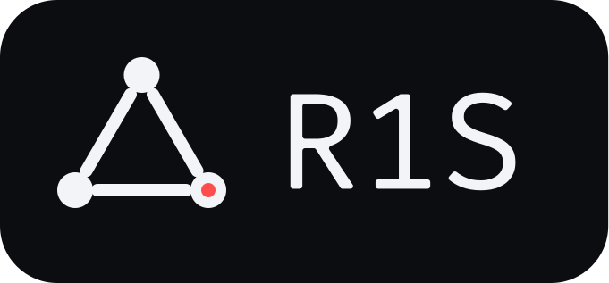

<div align="center">
  

  [](https://github.com/mytecor/r1s/releases/latest)[](https://github.com/mytecor/r1s/actions/workflows/ci.yml)

  **r1s** *("ris", Scandinavian for "rice")* is a decentralized OCI workload execution fabric over the Reticulum Network Stack (RNS).
</div>

## How it works

The `r1s` client publishes workload demand, collects offers from independent `r1sd` allocators, and
selects where to run each workload. There is no global API server, scheduler, registry, or shared
state.

1. A client broadcasts an execution request.
2. Allocators with available capacity return time-limited offers.
3. The client selects one offer and releases the others.
4. The selected allocator starts the OCI workload and reports its state.

Workloads continue through client disconnects and allocator restarts. Every RNS link authenticates
the peer identity and proves possession of the cluster key before carrying control messages.
Container logs remain local to the allocator and are transferred only after an explicit,
authenticated `logs` request.

See [ARCHITECTURE.md](./ARCHITECTURE.md) for protocol, authority, lifecycle, persistence, and adapter
boundaries.

## Install

Download an archive for Linux, macOS, or Windows from the
[releases page](https://github.com/mytecor/r1s/releases).
Copy binaries to a directory on `PATH`:

```sh
mkdir -p "$HOME/.local/bin"
cp r1s r1sd "$HOME/.local/bin/"
```

Release binaries are unsigned. On macOS, remove the quarantine attribute from browser downloads:

```sh
xattr -d com.apple.quarantine "$HOME/.local/bin/r1s" "$HOME/.local/bin/r1sd"
```

## Build from source

```sh
git clone https://github.com/mytecor/r1s
cd r1s
GOBIN="$HOME/.local/bin" go install ./cmd/r1s ./cmd/r1sd
```

`r1sd` requires a reachable containerd daemon, but does not require root itself. Run it as any user
that can access the containerd socket and write its configured identity, state, and log paths. Both
binaries require a Reticulum-Go configuration.

`--identity` accepts an existing or new identity file path, or a private RNS identity in the same
formats as Reticulum-Go's identity importer: 128-character hex, Base32, or Base64. Existing files take
priority. An inline identity is not persisted; its default state and log paths are placed under
`~/.config/r1s` and named with the public identity hash. Use `--state` and the allocator's `--logs`
flag to override them.

## Quick start

Create the cluster once on the first participant. Either binary can create it; this example uses a
client:

```sh
r1s cluster init
# Cluster ID: <public identifier>
# Join token: r1s1:<secret>
```

If an allocator is the first participant instead, run `r1sd cluster init`. Save the join token:
`init` prints it only once. Do not run `init` independently on other participants, because that
creates a different cluster.

Join every additional client with the same token to persist membership:

```sh
r1s cluster join 'r1s1:<secret>'
```

Join every allocator that did not create the cluster to persist membership, then start it:

```sh
r1sd cluster join 'r1s1:<secret>'
r1sd \
  --rns-config /etc/r1s/reticulum.conf \
  --identity /var/lib/r1s/identity \
  --capacity default=2
```

Both binaries store membership in `~/.config/r1s/cluster` by default, resolved for the OS account
running the process. For workload commands and `r1sd`, the global `--cluster` flag accepts either
an inline join token or a state file path. The value is first loaded as a file; if that file does
not exist, the same value is parsed as a join token:

```sh
r1sd --cluster 'r1s1:<secret>' \
  --rns-config /etc/r1s/reticulum.conf \
  --identity '<private RNS identity hex, Base32, Base64, or path>'

r1s --cluster /custom/path/to/cluster \
  --rns-config "$HOME/.config/r1s/reticulum.conf" \
  --identity "$HOME/.config/r1s/identity" \
  list
```

An inline token is not written to disk and must be supplied on every invocation. With
`cluster init`, `cluster join`, and `cluster show`, `--cluster` remains the destination state file
path.

The shared token establishes cluster membership; every participant still needs an RNS
configuration that can reach the others. An allocator using an admission allowlist must also
include each permitted client's RNS identity.

Submit a digest-pinned OCI image. Allocators are discovered through RNS announces:

```sh
r1s \
  --rns-config "$HOME/.config/r1s/reticulum.conf" \
  --identity "$HOME/.config/r1s/identity" \
  request \
  '{"workload":{"image":"registry.example/image@sha256:..."},"policy":{"maxRuntime":"600s","resultRetention":"86400s"},"resourceClass":"default"}'
```

The command returns durable request and execution IDs after assignment. Use the execution ID with
`inspect`, `cancel`, `result`, or `logs`; use `list` to show saved requests. Run `r1s --help` or a
subcommand with `--help` for all options.

## Documentation

- [ARCHITECTURE.md](./ARCHITECTURE.md) — component boundaries, authority, and lifecycle.
- [ROADMAP.md](./ROADMAP.md) — features, current status, and open work.
- [CONTRIBUTING.md](./CONTRIBUTING.md) — development and verification workflow.
