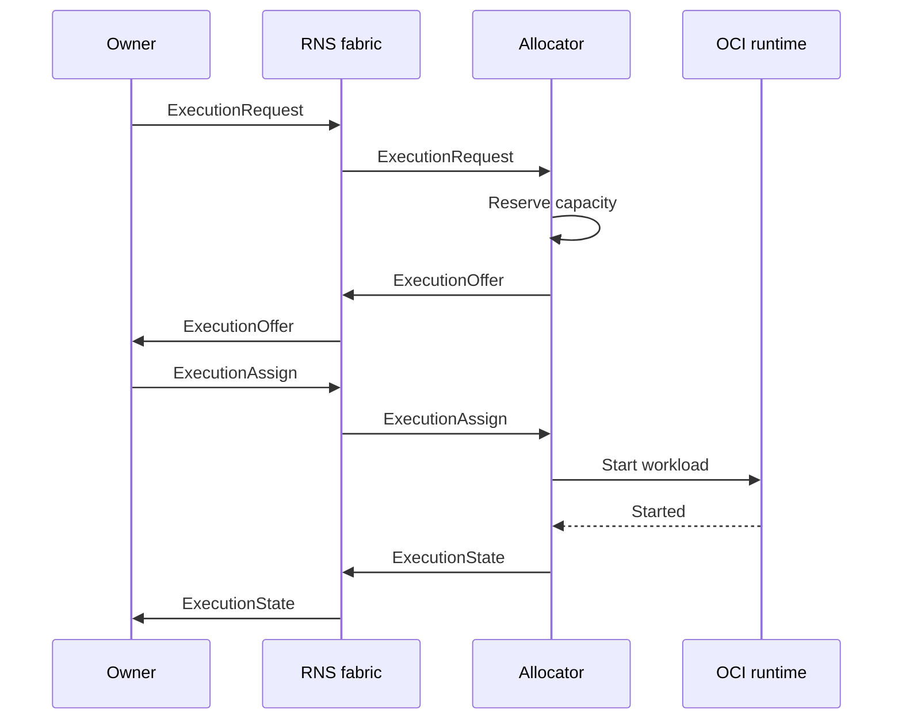

# r1s

r1s is a decentralized OCI workload execution fabric over the Reticulum Network Stack (RNS).
Owners publish workload demand, independent allocators offer local capacity, and an owner selects
an execution directly. There is no cluster-wide API server, scheduler, registry, or global state.

The name follows the same contraction pattern as Kubernetes → k8s: Reticulum Network Stack → r1s.

## Status

r1s has completed its transport-independent protocol foundation and RNS transport. The embedded
Reticulum-Go adapter, authenticated sender replacement, allocator announces, and `r1sd` entry point
are covered by a two-node loopback test. Python-reference discovery and reliable Channel envelope
delivery (including recovery from injected packet loss) are proven by a gated live harness. OCI
runtime work is in progress: durable allocator state and restart reconciliation are implemented
with deterministic tests and a gated live containerd recovery harness. Live lifecycle and recovery
acceptance remain to be run on a Linux host.

## Design principles

- **RNS-native:** discovery uses announces and control messages use authenticated RNS links.
- **No global control plane:** each owner controls its tasks; each allocator controls local capacity.
- **Asynchronous protocol:** Protobuf messages are carried over RNS without imposing HTTP/2 or RPC
  semantics on the network.
- **OCI workloads:** the core describes generic images, commands, environment, and execution policy.
- **Partition tolerant:** an owner disconnect is not a lifecycle event. Assigned work continues until
  completion, explicit cancellation, deadline, or maximum runtime.
- **Replaceable adapters:** network and runtime implementations sit behind small Go interfaces.

## Control flow



An offer reserves a bounded local slot. Workload start happens only after the owner selects that
offer, avoiding speculative image pulls on every allocator that sees a request.

## Development

System binaries follow the standard Go command layout. [`cmd/r1sd/`](./cmd/r1sd/) contains the
initial allocator daemon; `cmd/r1s/` will contain the owner CLI when F4 introduces it.

The initial allocator daemon can be run with an explicit Reticulum-Go configuration and persistent
identity:

```sh
go run ./cmd/r1sd \
  -rns-config ./reticulum.conf \
  -identity ./r1sd.identity \
  -capacity default=2,gpu=1 \
  -state ./r1sd.state.db \
  -containerd-address /run/containerd/containerd.sock \
  -containerd-namespace r1s
```

The daemon embeds Reticulum-Go; it does not require a separate Reticulum daemon. It does require a
reachable containerd daemon, and accepted OCI image references must be pinned by digest. The
`-containerd-snapshotter` flag selects a non-default snapshotter when needed. A UDP test pair can
use `listen_ip`, `listen_port`, `target_host`, and `target_port` in two Reticulum configuration files
with the listen and target ports swapped. `r1sd` runs as an endpoint, not an RNS routing transport,
and keeps Reticulum transport state beside the configured service identity.

Regenerate Go bindings after changing the Protobuf schema:

```sh
make generate
```

Generation requires `protoc` 36.0; the exact `protoc-gen-go` version is pinned in the
[Makefile](./Makefile) and installed automatically.

Run generated-code verification, race-enabled Go tests, and documentation link checks:

```sh
make check
```

Go 1.26.5 is recorded in [go.mod](./go.mod) as the language baseline.

Live interoperability against the upstream Python RNS reference is gated behind `RUN_LIVE_INTEROP=1`
and requires an interpreter that can import the `RNS` module (a pipx `rns` venv is auto-detected,
or point `PYTHON_INTEROP` at one). It spawns the reference peer and asserts that the Go endpoint
finds its r1s descriptor:

```sh
RUN_LIVE_INTEROP=1 go test ./internal/transport/rns/ -run TestPythonReference -v
```

Without the flag those tests skip, so `make check` stays green.

Live containerd lifecycle and restart-recovery acceptance are gated and require Linux, a reachable
containerd daemon, and a fixture image reference pinned by digest:

```sh
RUN_CONTAINERD_INTEGRATION=1 \
R1S_CONTAINERD_TEST_IMAGE='registry.example/image@sha256:...' \
go test ./internal/runtime/containerd/ -run 'TestContainerdFixture(Lifecycle|Recovery)' -v
```

Set `CONTAINERD_ADDRESS` when the daemon does not use `/run/containerd/containerd.sock`. Without the
gate, this test skips and remains compatible with ordinary `make check` runs.

Allocator state is stored in a transactional bbolt database. `-state` selects its path and defaults
to `<identity>.state.db`. The database is bound to the authenticated allocator identity; `r1sd`
refuses to load it under another identity.

## Documentation

- [AGENTS.md](./AGENTS.md) — repository rules for automated contributors.
- [ARCHITECTURE.md](./ARCHITECTURE.md) — component boundaries, authority, and lifecycle.
- [ROADMAP.md](./ROADMAP.md) — the roadmap: milestones, features, tasks, and open decisions.
- [CONTRIBUTING.md](./CONTRIBUTING.md) — development and verification workflow.

## License

r1s is available under the [MIT License](./LICENSE).
