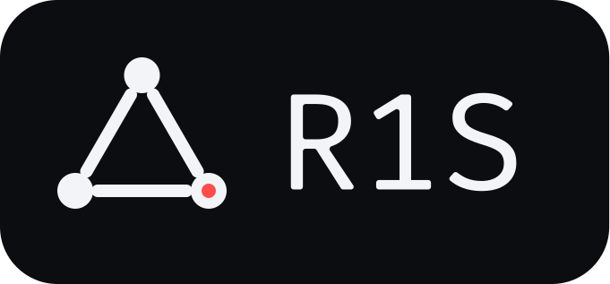

<div align="center">
  

  [](https://github.com/mytecor/r1s/releases/latest)[](https://github.com/mytecor/r1s/actions/workflows/ci.yml)

  **r1s** *("ris", Scandinavian for "rice")* is a decentralized OCI workload execution fabric over the Reticulum Network Stack (RNS).
</div>

## How it works

The `r1s` client publishes workload demand, collects offers from independent `r1sd` allocators, and
selects where to run each workload. There is no global API server, scheduler, registry, or shared
state.

1. A client broadcasts an execution request — optionally with exact-match placement constraints.
2. Allocators with available capacity (and, when constrained, only those whose advertised
   capabilities match) return time-limited offers.
3. The client selects one offer and releases the others.
4. The selected allocator starts the OCI workload and reports its state.

Workloads continue through client disconnects and allocator restarts. Every RNS link authenticates
the peer identity and proves possession of the cluster key before carrying control messages.
Container logs remain local to the allocator and are transferred only after an explicit,
authenticated `logs` request.

RNS is the resilient, low-bandwidth control plane. OCI images remain ordinary digest-pinned registry
references fetched by containerd.

Each `r1s run` is one immutable execution attempt of a logical run. The client holds an
in-memory lease for the run's lifetime, tails allocator-local logs to the terminal, and — on
authenticated evidence that the previous execution is gone — re-requests the recorded workload as
the next attempt of the same run. A conclusive lease loss re-requests without pinning to the
previous allocator.

See [ARCHITECTURE.md](./ARCHITECTURE.md) for protocol, authority, lifecycle, persistence, and adapter
boundaries.

## Install

Download an archive for Linux, macOS, or Windows from the
[releases page](https://github.com/mytecor/r1s/releases).
Copy binaries to a directory on `PATH`:

```sh
mkdir -p "$HOME/.local/bin"
cp r1s r1sd "$HOME/.local/bin/"
```

Release binaries are unsigned. On macOS, remove the quarantine attribute from browser downloads:

```sh
xattr -d com.apple.quarantine "$HOME/.local/bin/r1s" "$HOME/.local/bin/r1sd"
```

## Build from source

```sh
git clone https://github.com/mytecor/r1s
cd r1s
GOBIN="$HOME/.local/bin" go install ./cmd/r1s ./cmd/r1sd
```

`r1sd` requires a reachable containerd daemon, but does not require root itself. Run it as any user
that can access the containerd socket and write its configured identity, state, and log paths.
Both binaries require an already-running Reticulum shared instance (`reticulum-go` or Python
`rnsd`) and attach to its platform-default local endpoint. They fail closed when the shared
instance is unavailable; r1s never starts a private RNS stack or takes ownership of the shared
listener.

Execution tunnels require Linux and a local containerd daemon in the same PID namespace as
`r1sd`. The tunnel connects to loopback inside the selected container's network namespace;
it never forwards client-selected ports to the allocator host. The allocator needs permission
to read the task's namespace and enter it (`CAP_SYS_ADMIN`), plus `CAP_NET_ADMIN` to bring up
loopback in a fresh container namespace. Missing permissions fail the stream explicitly;
normal workload execution does not require enabling tunnels.

RNS remains the discovery, identity, and control plane. Tunnel application bytes use the dedicated
embedded Yggdrasil adapter; RNS never carries application bytes.

The `run` path creates a client identity only in memory, keeps no client database, selects
compatible offers deterministically, holds the execution lease, and reannounces a higher attempt of
the same run only after authenticated evidence that the previous execution is gone.

## Go client API

Applications can participate in r1s directly through the public
[`client`](./client) package. The library is the run controller; the `r1s run` command is a frontend
over the same API. Applications may open locally joined credentials directly. The CLI instead uses
the local authority broker selected by `r1s cluster use`: the broker retains the cluster key and
creates a fresh ephemeral RNS endpoint for each run process, while the run process still owns all
request, lease, reschedule, log, and tunnel state.

```go
controller, err := client.Open(clusterID, client.Config{})
if err != nil {
    return err
}
defer controller.Close()
if err := controller.Start(ctx); err != nil {
    return err
}

result, err := controller.Run(ctx, &r1sv1.ExecutionRequest{
    Workload:      &r1sv1.Workload{Image: image},
    Policy:        &r1sv1.ExecutionPolicy{},
    ResourceClass: "default",
}, client.RunOptions{})
```

`Run` owns discovery, offer selection and release, assignment, lease renewal, authenticated
inspection, and conclusive-loss rescheduling. It never transfers container output implicitly;
applications call `Logs` for an explicit authenticated bounded read. Applications that need byte
streams into the current attempt create a lazy run-owned tunnel and switch it from the run event
callback:

```go
runTunnel, err := controller.NewRunTunnel([]client.TunnelTarget{{Port: 9000}})
if err != nil {
    return err
}
defer runTunnel.Close()

result, err := controller.Run(ctx, request, client.RunOptions{
    OnEvent: func(event client.Event) {
        if event.Kind == client.EventAttemptAssigned {
            runTunnel.SetActive(event.Attempt.ExecutionID)
        }
    },
})
// A concurrent goroutine may call runTunnel.Dial(ctx, 9000).
```

`RunTunnel.Dial` lazily creates the private Yggdrasil edge and reuses one authenticated,
multiplexed pair for the active execution. Switching attempts closes that pair and its existing
streams; a later dial establishes a pair to the replacement, so application protocols reconnect
explicitly rather than being silently rerouted. The target list is fixed at construction and is
validated again by the allocator. The lower-level `OpenTunnel` control operation remains available,
but consumers of `RunTunnel` do not import any internal transport package. One `Client` owns exactly
one logical run and one live run tunnel; create another client to obtain fresh authority for another
run.

## Quick start

Create the cluster once on the first participant. Either binary can create it; this example uses a
client:

```sh
r1s cluster init
# Cluster ID: <public identifier>
# Join token: r1s1:<secret>
```

If an allocator is the first participant instead, run `r1sd cluster init`. Save the join token:
`init` prints it only once. Do not run `init` independently on other participants, because that
creates a different cluster.

Join every additional client with the same token to persist membership, then select it for the
local CLI authority session:

```sh
r1s cluster join 'r1s1:<secret>'
r1s cluster use -d <cluster-id-or-unique-prefix>
```

Join every allocator that did not create the cluster to persist membership, then start it:

```sh
r1sd cluster join 'r1s1:<secret>'
r1sd \
  --identity /var/lib/r1s/identity \
  --capacity default=2 \
  <cluster-id-or-unique-prefix>
```

On startup, each allocator records its public 16-byte RNS destination in the selected credential.
After the first allocator is running, export an updated membership bundle for other participants:

```sh
r1sd cluster token <cluster-id-or-unique-prefix>
# Join token: r1s1:<secret-and-public-bootstrap-bundle>
```

An updated `r1s1:` token contains the same realm secret plus a bounded set of public allocator
destination hints. Join or rejoin every client with this token before starting its broker; joining
the same cluster again merges the hints without changing membership:

```sh
r1s cluster join 'r1s1:<secret-and-public-bootstrap-bundle>'
r1s cluster use -d <cluster-id-or-unique-prefix>
```

Both binaries store credentials in `~/.config/r1s/realms/<cluster-id>`, with each secret
indexed by its full derived public ID and public bootstrap hints kept in a separate field. List the
available non-secret IDs with either binary:

```sh
r1s cluster list
```

The meshbus cutover intentionally does not import the former
`~/.config/r1s/clusters/` store: realm IDs and authentication domains changed. Rejoin with the
original token to write the credential under its new realm-derived ID.

`r1s cluster use` accepts a full ID or a unique hexadecimal prefix, starts the per-user local
authority broker in the foreground, and blocks until interrupted or stopped with `cluster unset`
from another terminal. Add `-d` or `--detach` to run the broker in the background. `cluster status`
reports the current cluster and `cluster unset` stops its broker. The allocator remains explicit
and requires exactly one positional cluster operand. Join tokens are accepted only by
`cluster join`, never as runtime selectors:

```sh
r1sd --identity /var/lib/r1s/identity <cluster-id-or-unique-prefix>
r1s cluster use -d <cluster-id-or-unique-prefix>
r1s run '<ExecutionRequest JSON>'
```

Successful completion exits zero; a workload status from 1 through 255 is preserved. A terminal
failure without a usable workload status exits 1, SIGINT exits 130, and SIGTERM exits 143. The
foreground run tails allocator-local stdout/stderr to the matching terminal streams, and
`-d/--log-file` detaches to a background child that records all attempts under
`~/.local/state/r1s/runs/<run-id>/`. `-p/--publish host:container` (repeatable) binds a local
loopback listener for the run's lifetime and relays each inbound connection to the container port of
the currently active execution attempt over one authenticated tunnel; the listener stays bound
across reschedules while new streams are authenticated and spliced to the replacement execution.

The previous single file at `~/.config/r1s/cluster` is not imported or selected automatically.

The shared token establishes cluster membership; the shared RNS daemon owns the interfaces and
routing that reach the other participants. An allocator using an admission allowlist must also
include each permitted client's RNS identity.

Submit a digest-pinned OCI image. Allocators are discovered through RNS announces:

```sh
r1s run \
  '{"workload":{"image":"registry.example/image@sha256:..."},"policy":{},"resourceClass":"default"}'
```

The public run controller creates the request and assignment in memory, holds the execution lease
for the run's lifetime, tails allocator-local stdout/stderr to the terminal, and re-requests the
recorded workload as the next attempt only after authenticated evidence that the previous
execution is gone. The broker socket carries authenticated discovery and control envelopes but no
run state; one broker-created endpoint belongs to one run process. An execution whose lease expires
without renewal is evicted locally and its workload re-requested. Container logs stay
allocator-local and are transferred only over the authenticated log stream the run tail opens.

Run `r1s --help` or `r1s run --help` for all options.

## Documentation

- [ARCHITECTURE.md](./ARCHITECTURE.md) — component boundaries, authority, and lifecycle.
- [ROADMAP.md](./ROADMAP.md) — features, current status, and open work.
- [CONTRIBUTING.md](./CONTRIBUTING.md) — development and verification workflow.
